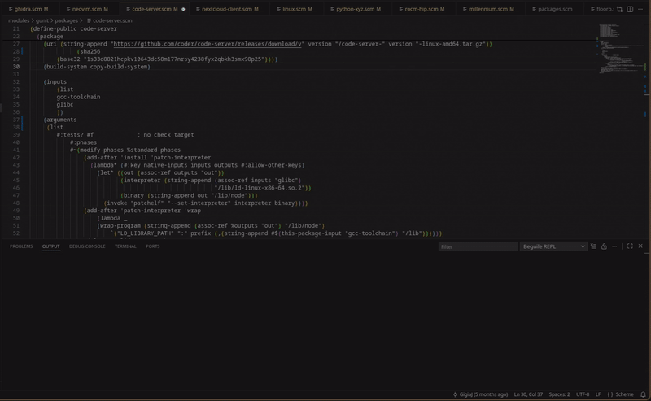

# Beguile

A VS Code plugin to make developing in Guile Scheme for Guix development (or any other development) far more pleasant.
The goal being to be closer to a Calva experience in VS Code. Writing Clojure in VS Code is delightful, and Scheme
should have a similar option that isn't just EMacs.

Prerequisites:
- Guile installed on the host system (similar to how the neovim extension works) 
    - Guix          GuixSD and the package manager come with Guile by default
    - Debian:       ```sudo apt install guile-3.0```
    - Fedora        ```sudo dnf install guile```
    - Arch          ```sudo pacman -S guile```
    - OpenSUSE     ```sudo zypper install guile```
    - Mac (Brew)   ```brew install guile```
    - pkgsrc       ```pkgin install guile```
- Guile JSON (named guile-json on almost all major package managers)
    - Guix          ```guix install guile-json``` (Add this to your home configuration instead)
    - Debian:       ```sudo apt install guile-json```
    - Fedora        ```sudo dnf install guile-json```
    - Arch          ```sudo pacman -S guile-json```
    - OpenSUSE     ```sudo zypper install guile-json```
    - Mac (Brew)   ```brew install guile-json```
    - pkgsrc       ```pkgin install guile-json```
- Guix installed (easiest way to supply the guix libraries to Guile for clean, opinionated formatting 
                  by one of the language's maintainers and creator of Guix)
    - Guix          GuixSD and the package manager come with Guile by default
    - Debian:       ```sudo apt install guix```
    - Fedora        ```sudo dnf install guix```
    - Arch          ```sudo pacman -S guix```
    - OpenSUSE     ```sudo zypper install guix```
    - Mac (Brew)   ```brew install guix```
    - pkgsrc       ```pkgin install guix```


Windows users should use WSL. Native Guile experience on Windows is going to be unpleasant.

### Current features:
- Simple REPL
- LSP (uses guile under the hood for evaluation and for REPL)
- Hover docs
- Syntax highlighting
- Auto-completion (Intellisense)
- Auto-formatter on save
- Rainbow parenthesis
- Go To (on hover + control + click) definition
- Paredit (aiming for a Calva-lite experience)
    - forwardSExpression
    - backSExpression
    - selectedForwardSExpression
    - selectedBackSExpression
- Written in CLJS and Guile


#### will re-add
    - forwardSlurp
    - forwardBarf
    - splice
    - wrap




### Future plans:
In the future, I'll likely rewrite this into Clojurescript. Typescript was just far easier as there are far more docs on building an extension in Typescript.
- More heavyweight REPL experience (CIDER maybe).
- Expand on the LSP and make the evaluation more intelligent.
- Add evaluation for Guix GExpressions (this may make more sense splitting out and making an add-on plugin for)
- Clojure-like usage examples in the hover behavior would be amazing, but I don't think Guile has the same infrastructure in place to easily do so.
- Pop-ups for if the server crashed
- Preload the system library and some helper libraries
- Bind the version to the tag more cleanly...
- forwardSexp and backwardSexp can get VERY confused if there are unmatched symbols (such as quotes)
- Macro expansion preview
- Linting
- Syntax checking


For now though, this is the most complete Guile writing experience for VS Code.